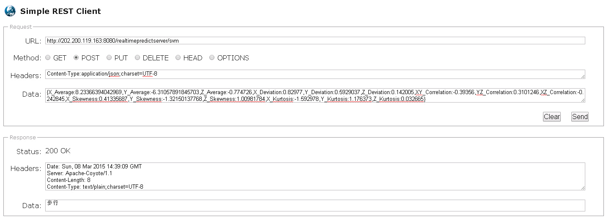

RealTimePredictServer
---

项目简介
---

本项目为毕业设计人体行为识别预测服务端，采用Servlet实现，预测模型之前已经训练好，主要包括SVM和DecisionTree。Android客户端实时收集手机内置的三轴加速度数据，并暂存。当暂存数据满足指定窗口大小(20)时，便进行特征提取，提取的特征主要包括：

- 均值
- 方差
- 两轴之间相关系数
- 偏度
- 峰度

提取过程完成后，通过Servlet请求将之前提取的特征封装成对象传递到预测服务端，服务端进行解析，并调用预测模型进行动作的识别，目前识别的动作主要包含以下几个：

- 上楼
- 下楼
- 步行
- 站立

要点
---

部署本项目时，需要修改SVM算法Servlet中指定的svm\_test\_set绝对路径为部署时Tomcat服务的绝对路径。

用法
---
部署完成后，需要结合RealTimePredictClient（Android客户端）使用。Android客户端收集手机内置的三轴加速度数据，并进行相应特征的提取，并以json的格式发送给本服务端，服务端接收到POST请求后，调用识别模型进行识别，并将识别的结果以text/plain的形式返回给Android客户端。也可通过Simple REST Client（Chrome插件）工具模拟POST请求。

Example：

1. 测试数据： 
```
{X_Average:8.23366394042969,Y_Average:-6.31057891845703,Z_Average:-0.774726,X_Deviation:0.82977,Y_Deviation:0.5929037,Z_Deviation:0.142005,XY_Correlation:-0.39356,YZ_Correlation:0.3101246,XZ_Correlation:-0.242845,X_Skewness:0.41335687,Y_Skewness:-1.32150137768,Z_Skewness:1.00981784,X_Kurtosis:-1.592978,Y_Kurtosis:1.176373,Z_Kurtosis:0.032665}
```
2. 发送POST请求，如
http://202.200.119.163:8080/realtimepredictserver/svm
http://202.200.119.163:8080/realtimepredictserver/decisiontree

3. 返回结果



代码类简要介绍
---

1. PredictAttribute
存储Android客户端传过来的封装好的待识别特征